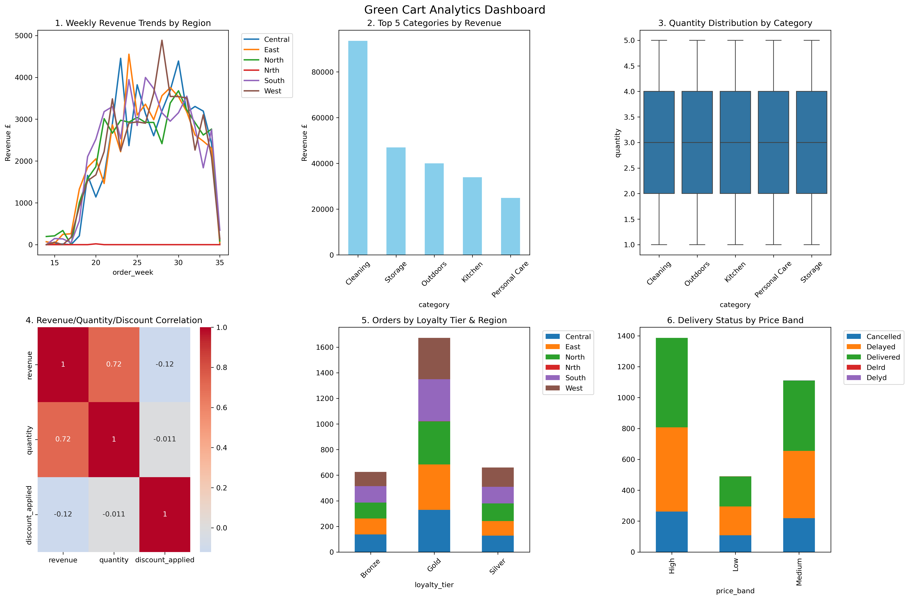

# 🛒 Green Cart Sales & Customer Behavior Analysis

## 📊 Project Overview

This project analyzes sales, customer, and product data for Green Cart Ltd. to uncover key business insights related to revenue trends, customer behavior, and operational performance.

The goal is to support better decision-making in marketing, pricing, and logistics.

---

## 🎯 Business Problem

* Identify top revenue-driving product categories
* Understand customer segments and their value
* Detect regional delivery performance issues
* Evaluate the impact of discounts on sales

---

## 📁 Dataset

* 3,000 orders
* 500 customers
* 30 products
* Features include: region, delivery status, pricing, loyalty tier

---

## 🧹 Data Cleaning

* Standardized inconsistent values (region, delivery status, loyalty tier)
* Handled missing values (filled or removed)
* Removed duplicate records
* Converted date columns to datetime format

👉 Final dataset: **2,990 clean records**

---

## ⚙️ Feature Engineering

* Revenue calculation (after discount)
* Weekly order trends
* Price band segmentation (Low / Medium / High)
* Days-to-order (product lifecycle analysis)
* Email domain extraction (customer segmentation)
* Late delivery indicator

---

## 📈 Key Insights

* Cleaning category generates the highest revenue (~39%)
* Central and East regions lead in sales performance
* East and North regions show high delivery delays (~40%)
* Gold-tier customers generate the highest revenue
* Discounts do not significantly increase sales volume

---

## 📊 Dashboard

---

## 💡 Recommendations

* Reduce discounts on Cleaning products to improve margins
* Improve logistics in East and North regions
* Focus on acquiring and retaining high-value (Gold-tier) customers
* Optimize pricing strategy instead of relying on discounts

---

## 🛠 Tools Used

* Python (Pandas, NumPy)
* Data Visualization (Matplotlib, Seaborn)
* Jupyter Notebook

---

## 📄 Project Report

Detailed analysis and methodology available in the project report (PDF).

---

## 🚀 Conclusion

This project demonstrates how data cleaning, feature engineering, and analysis can generate actionable insights to improve business performance and support strategic decisions.
